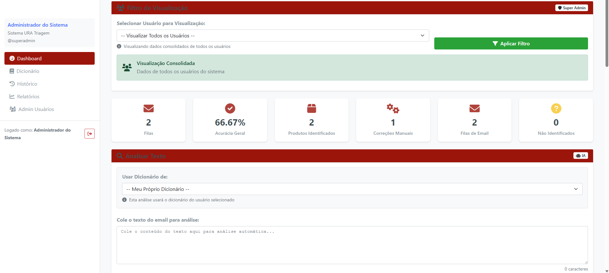
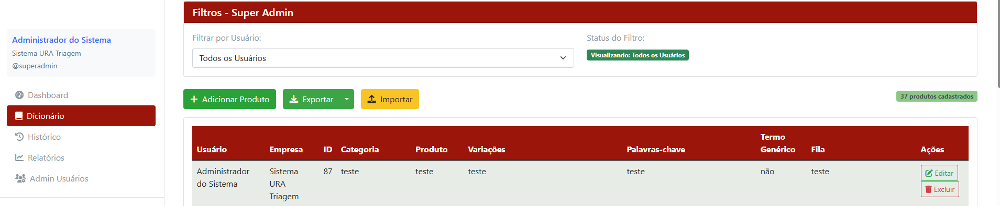

# 🎯 Sistema de Análise e Classificação Automática de Textos

## 📋 Sobre o Projeto

Sistema completo de **análise e classificação automática de textos** desenvolvido em Python/Flask, com arquitetura multi-usuário e SaaS. A aplicação identifica automaticamente **produtos, categorias e filas de atendimento** em textos de suporte técnico, emails e interações de clientes.

**🚫 Nota:** Este repositório contém apenas documentação e screenshots para fins de portfólio. O código fonte não está disponível para instalação.

## ✨ Funcionalidades Principais

### 🔍 **Análise Inteligente**
- Identificação automática de produtos e categorias em textos
- Detecção de contexto e associação com filas de atendimento
- Sistema de aprendizado contínuo com correções manuais
- Análise em tempo real via servidor dedicado

### 👥 **Gestão Multi-Usuário**
- **Super Admin**: Acesso completo ao sistema
- **Perfil Email**: Focado em atendimento por email
- **Perfil URA**: Otimizado para sistemas de voz
- **Usuário Padrão**: Acesso básico às funcionalidades

### 📊 **Dashboard e Relatórios**
- Métricas de desempenho em tempo real
- Gráficos interativos (pizza e barras)
- Top produtos, categorias e filas mais frequentes
- Histórico completo de análises

### 🗂️ **Gestão de Dicionários**
- Cadastro de produtos, categorias e palavras-chave
- Importação/exportação em Excel
- Variações de produtos e termos contextuais
- Associação automática com filas de atendimento

## 🛠️ **Tecnologias Utilizadas**

- **Backend**: Python, Flask, MySQL
- **Frontend**: HTML, CSS, JavaScript, Bootstrap
- **Análise**: Servidor dedicado com algoritmos personalizados
- **Visualização**: Matplotlib, Pandas
- **Segurança**: Hash SHA256, HMAC, SSL

## 🏗️ **Arquitetura do Sistema**

```
┌─────────────────┐    ┌──────────────────┐    ┌──────────────┐
│   Interface Web │ ── │   Flask App      │ ── │  MySQL       │
│   (Frontend)    │    │   (Backend)      │    │  (Database)  │
└─────────────────┘    └──────────────────┘    └──────────────┘
                                │
                        ┌──────────────────┐
                        │ Servidor Análise │
                        │ (Localhost:5500) │
                        └──────────────────┘
```

## 📸 **Demonstração Visual**

### 🖥️ **Dashboard Principal**

*Visão geral do sistema com métricas e gráficos em tempo real*

### 🔍 **Tela de Análise**
*Interface para análise de textos e identificação automática*

### 📚 **Gestão de Dicionário**

*Cadastro e gestão de produtos, categorias e palavras-chave*

### 📈 **Relatórios e Estatísticas**
*Gráficos detalhados e métricas de desempenho*

### 👥 **Administração de Usuários**
*Painel de gestão multi-usuário e perfis de acesso*

## 🎯 **Casos de Uso Implementados**

### 📞 **Central de Atendimento**
- Roteamento automático de chamadas para filas corretas
- Identificação de produtos em solicitações de suporte
- Otimização do tempo de resposta

### 📧 **Gestão de Emails**
- Classificação automática de mensagens
- Priorização baseada em produtos/serviços
- Métricas de volume por categoria

## 🚀 **Fluxo de Uso**

1. **Login** → Acesso seguro ao sistema
2. **Análise** → Identificação automática em textos
3. **Gestão** → Configuração de produtos e categorias
4. **Relatórios** → Acompanhamento de métricas
5. **Correções** → Aprimoramento contínuo do sistema

## 💡 **Destaques Técnicos**

- **Arquitetura multi-camadas** com separação de concerns
- **Segurança avançada** com proteção contra ataques
- **Sistema de aprendizado** com correções manuais
- **Interface responsiva** e intuitiva
- **Relatórios em tempo real** com visualizações gráficas

## 👨‍💻 **Desenvolvido por**

**Vitor Dos Santos** - [vitorr.dsantoss@gmail.com]